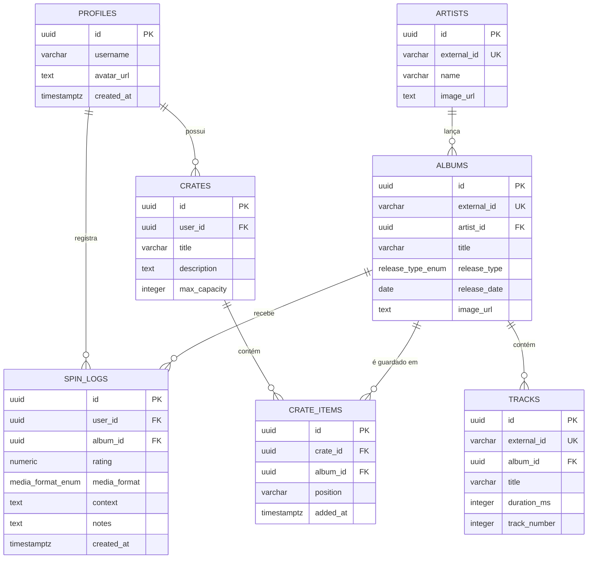

# Crate Music 💿

> Um aplicativo social de catalogação e resenhas musicais inspirado na experiência tátil e física de colecionar e ouvir discos, construído no ecossistema Next.js e Supabase.

---

## 💡 CONCEITO!

**Crate Music** é uma plataforma que funciona como um "Letterboxd para música", mas com foco em um ato ritualístico de ouvir um álbum. Em vez de focar apenas em feeds digitais estéreis ou resenhas complexas e pretensiosas, o aplicativo destaca a conexão física do ouvinte com a música. 

O diferencial do projeto é o resgate do hábito de "garimpar" e "colecionar":
*   **Spin Log** : Onde os usuários registram suas audições definindo não apenas a nota, mas também o **formato da mídia** (Vinil, CD, Cassete, Streaming, Ao vivo) e o **contexto** em que a escuta aconteceu (ex: fones de ouvido à noite, trânsito, etc.).
*   **Virtual Crate** : Uma simulação digital de caixas de discos físicas, onde os usuários criam coleções personalizadas e limitadas, folheando as capas com um efeito visual que imita a interação com o vinil real.

---

## 🛠️ STACK!

O projeto foi estruturado utilizando tecnologias modernas que garantem desempenho, tipagem estrita e escalabilidade de baixo custo:

*   **Frontend:** [Next.js (App Router)](https://nextjs.org/) — Renderização híbrida no servidor (RSC) e Client Components.
*   **Estilização:** [Tailwind CSS](https://tailwindcss.com/) — Design responsivo e minimalista com animações otimizadas para GPU.
*   **Banco de Dados & Auth:** [Supabase (PostgreSQL)](https://supabase.com/) — Armazenamento relacional, controle de sessão via cookies e automações internas em PL/pgSQL.
*   **Integração:** [Spotify Web API](https://developer.spotify.com/) — Motor de busca transiente de metadados musicais em tempo real.
*   **Hospedagem & CI/CD:** [Vercel](https://vercel.com/) — Deploy contínuo integrado diretamente ao GitHub.

---

## 🧠 ARQUITETURA E ENGENHARIA!

Este projeto foi desenhado sob princípios rigorosos de Sistemas de Informação para otimização de recursos e integridade de dados:

### 1. Ingestão JIT (Just-In-Time) de Metadados
Para evitar o armazenamento redundante de milhões de álbuns e artistas do catálogo global da API do Spotify, adotamos a **ingestão JIT**. Os dados de busca trafegam de forma transiente no cliente e no servidor. Somente no instante em que um usuário decide avaliar um disco ou adicioná-lo à sua caixa virtual é que o backend executa um fluxo transacional atômico (`UPSERT`):
*   Verifica se o Artista já existe no Supabase (pelo ID externo). Se não existir, insere-o.
*   Verifica se o Álbum já existe no Supabase. Se não existir, insere-o vinculando ao ID interno do artista.
*   Insere o registro de avaliação (`spin_log`) ou item na caixa (`crate_item`).

### 2. Automação de Perfis com Gatilhos (Triggers) em PL/pgSQL
O gerenciamento de usuários é isolado pelo serviço de autenticação do Supabase (`auth.users`). Para sincronizar as contas criadas com nossa tabela de perfis públicos (`public.profiles`) sem sobrecarregar a API do Next.js, criamos uma função e um gatilho nativos do PostgreSQL. Ao registrar-se, o banco se auto-gerencia e cria o perfil automaticamente.

### 3. Ordenação Lexicográfica Eficiente (Fractional Indexing)
A tabela `crate_items` foi projetada para suportar reordenação manual futura de itens dentro da caixa (Drag & Drop) com complexidade de escrita de $O(1)$. Em vez de índices inteiros que exigiriam atualizar todos os registros subsequentes no banco de dados ao mover um disco, utilizamos Strings de ordenação lexicográfica. Ao mover um disco, apenas uma única coluna daquele registro é alterada.

---

## 🗄️ MODELAGEM BD!

O banco de dados relacional (PostgreSQL) segue a seguinte estrutura normalizada:



## 🚀 Como Executar o Projeto Localmente

### Pré-requisitos
*   [Node.js (versão LTS)](https://nodejs.org/)
*   [Git](https://git-scm.com/)
*   Uma conta no [Supabase](https://supabase.com/) e no [Spotify Developer](https://developer.spotify.com/)

### Passo a Passo

1.  **Clonar o repositório:**
    ```bash
    git clone https://github.com/costagus/crate-music.git
    cd crate-music
    ```

2.  **Instalar as dependências:**
    ```bash
    npm install
    ```

3.  **Configurar o Banco de Dados (Supabase):**
    No editor SQL do Supabase, execute o schema de tabelas e gatilhos que se encontram na pasta de modelagem do projeto (ou utilize o script completo de migração).

4.  **Configurar Variáveis de Ambiente:**
    Crie um arquivo `.env.local` na raiz do projeto com as chaves copiadas do seu painel do Supabase e do Spotify Developer Dashboard:
    ```env
    NEXT_PUBLIC_SUPABASE_URL=https://seu_projeto.supabase.co
    NEXT_PUBLIC_SUPABASE_ANON_KEY=sua_anon_key_aqui

    SPOTIFY_CLIENT_ID=seu_client_id_aqui
    SPOTIFY_CLIENT_SECRET=seu_client_secret_aqui
    ```

5.  **Iniciar o Servidor de Desenvolvimento:**
    ```bash
    npm run dev
    ```
    Acesse o aplicativo em seu navegador através do endereço `http://localhost:3000`.

---

## 📈 Próximos Passos de Desenvolvimento
*   [ ] Adicionar suporte a múltiplos tópicos de tags (moods, cenários) nas caixas virtuais.
*   [ ] Implementar o drag-and-drop interativo com `@dnd-kit` de forma visual dentro das caixas.
*   [ ] Aplicar as políticas de segurança de Row Level Security (RLS) granulares para compartilhamento público de caixas entre perfis de usuários.

---

## 🎓 AUTOR!
Desenvolvido por **Gustavo Melo** como projeto de estudo prático e aprofundamento em arquiteturas robustas de sistemas de informação e bancos de dados relacionais.
